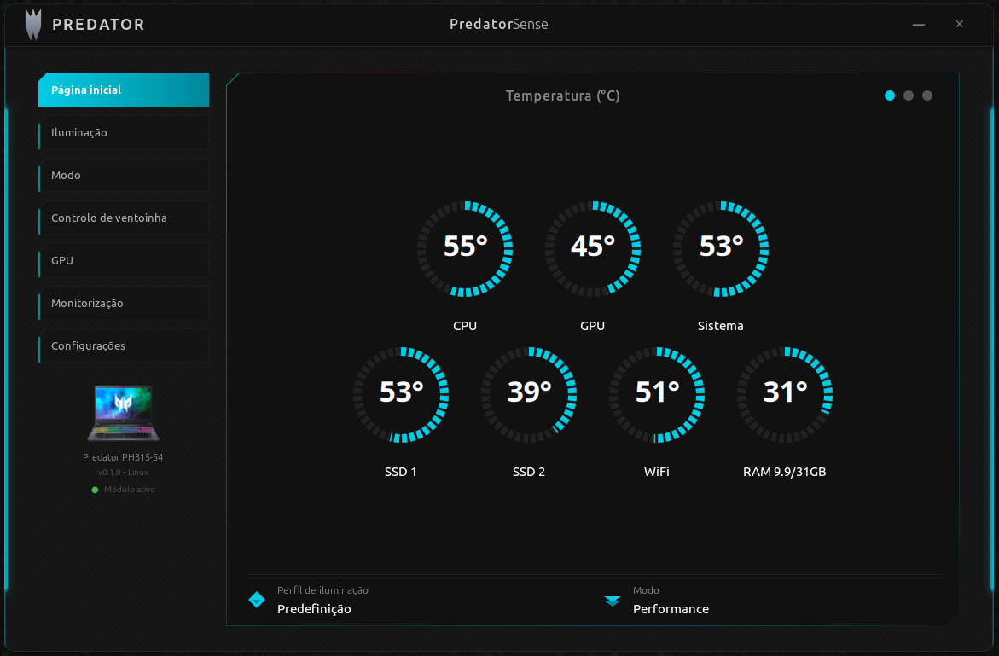
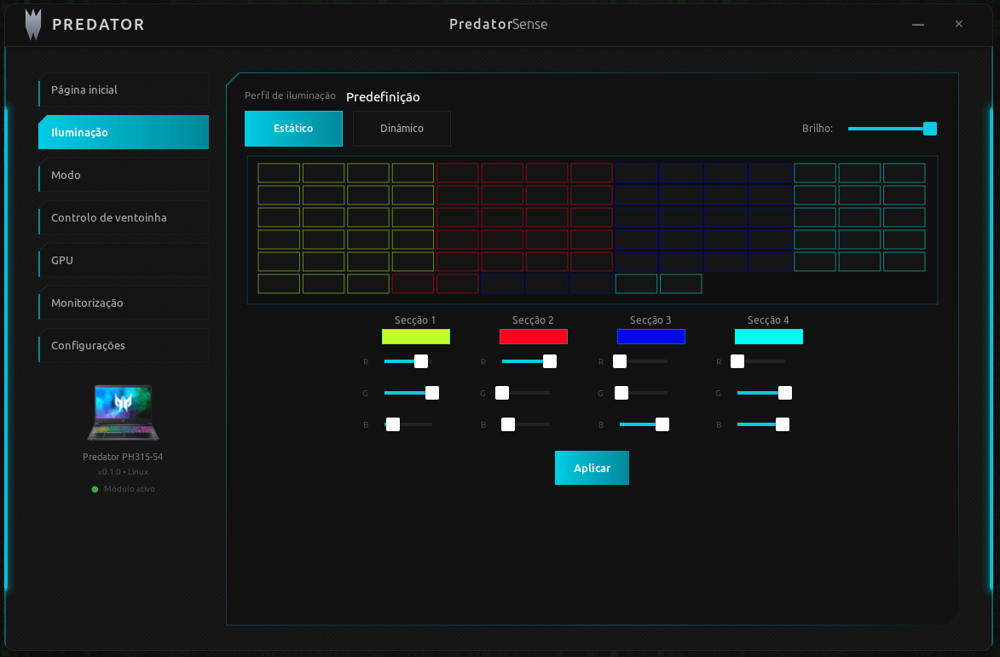
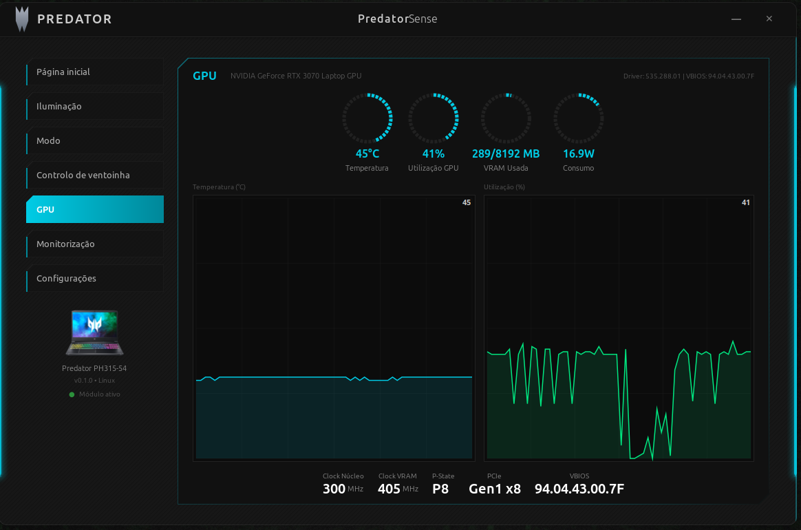

# Predator Sense para Linux

<p align="center">
  <a href="README.md">🇺🇸 Read in English</a>
</p>

<p align="center">
  
</p>

<p align="center">
  <b>Módulo não oficial do kernel Linux e interface gráfica para controle de hardware de notebooks Acer Gaming</b><br>
  <i>Retroiluminação RGB do Teclado &bull; Modo Turbo &bull; Monitoramento de Temperatura &bull; Perfis de Desempenho</i>
</p>

<p align="center">
  
  
  
  
  
</p>

---

## Aviso Legal

> **Atenção**
> **Use por sua conta e risco!** Este é um projeto **não oficial**. A Acer não esteve envolvida no seu desenvolvimento. O módulo do kernel foi desenvolvido por meio de engenharia reversa do aplicativo oficial PredatorSense para Windows. Este driver interage com métodos WMI/ACPI de baixo nível que não foram testados em todas as séries de notebooks. Os autores não se responsabilizam por quaisquer danos ao seu hardware.

> **Nota**
> Todas as marcas registradas, nomes de produtos e logotipos mencionados (Acer, Predator, PredatorSense, Helios, Nitro, AeroBlade, CoolBoost) são propriedade de seus respectivos donos (Acer Inc.). Este projeto não é afiliado, endossado ou patrocinado pela Acer Inc. de nenhuma forma.

Esta aplicação foi criada para **uso pessoal**, para tirar o máximo proveito de um notebook Acer gaming no Linux — já que a Acer não oferece suporte oficial do PredatorSense para Linux. É compartilhada livremente para quem quiser o mesmo.

---

## Capturas de Tela

<p align="center">
  
  <br><i>Página Inicial — Gauges de temperatura em tempo real para CPU, GPU, Sistema, SSDs, WiFi e RAM</i>
</p>

<p align="center">
  
  <br><i>Iluminação — Cores estáticas por zona (4 secções) e efeitos dinâmicos RGB do teclado</i>
</p>

<p align="center">
  
  <br><i>GPU — Dashboard NVIDIA com gráficos em tempo real, clock, utilização, VRAM e consumo</i>
</p>

---

## Sobre

Módulo não oficial do kernel Linux para retroiluminação RGB de teclados Acer Gaming e modo Turbo (Acer Predator, Acer Helios, Acer Nitro).

Inspirado e baseado no projeto [acer-predator-turbo-and-rgb-keyboard-linux-module](https://github.com/JafarAkhondali/acer-predator-turbo-and-rgb-keyboard-linux-module) de [JafarAkhondali](https://github.com/JafarAkhondali) e contribuidores. Este projeto estende o módulo atual do kernel Linux Acer-WMI para oferecer suporte às funções de jogos da Acer, e adiciona uma **aplicação desktop completa** desenvolvida em Rust e GTK4.

---

## Funcionalidades

| Funcionalidade | Descrição |
|----------------|-----------|
| **Controle RGB do Teclado** | Cores estáticas por zona (4 zonas) e efeitos dinâmicos (Respiração, Neon, Onda, Deslizar, Zoom) |
| **Monitoramento de Temperatura** | Temperaturas em tempo real de CPU, GPU, SSD, WiFi e sistema |
| **Dashboard GPU** | Métricas NVIDIA: temperatura, utilização, VRAM, clocks, consumo com gráficos ao vivo |
| **Perfis de Desempenho** | Silencioso / Balanceado / Performance / Turbo (CPU governor + Intel EPP) |
| **Controle de Ventoinha** | Monitoramento de velocidade e seleção de modo |
| **RAM e Rede** | Gauge de uso de memória e velocidade de rede |
| **Bandeja do Sistema** | Minimizar para a bandeja com o ícone Predator |
| **Tecla PredatorSense** | Mapeamento da tecla física — a tecla ao lado do NumLock abre a aplicação |
| **Internacionalização** | Inglês / Português automático baseado no idioma do sistema |
| **Interface Gaming** | Tema escuro com barras neon pulsantes, gauges circulares tracejados, bordas poligonais |

---

## Compatibilidade

**Vai funcionar no meu notebook?**

| Modelo | Modo Turbo (Implementado) | Modo Turbo (Testado) | RGB (Implementado) | RGB (Testado) |
|--------|:-------------------------:|:--------------------:|:-------------------:|:-------------:|
| AN515-45 | - | - | Sim | Sim |
| AN515-55 | - | - | Sim | Sim |
| AN515-56 | - | - | Sim | Sim |
| AN515-57 | - | - | Sim | Sim |
| AN515-58 | - | - | Sim | Sim |
| AN517-41 | - | - | Sim | Sim |
| PH315-52 | Sim | Sim | Sim | Sim |
| PH315-53 | Sim | Sim | Sim | Sim |
| **PH315-54** | **Sim** | **Sim** | **Sim** | **Sim** |
| PH315-55 | Sim | Instável | Sim | Não |
| PH317-53 | Sim | Sim | Sim | Sim |
| PH317-54 | Sim | Não | Sim | Não |
| PH517-51 | Sim | Não | Sim | Não |
| PH517-52 | Sim | Não | Sim | Não |
| PH517-61 | Parcial | Parcial | Sim | Sim |
| PH717-71 | Sim | Não | Sim | Não |
| PH717-72 | Sim | Não | Sim | Não |
| PHN16-71 | Sim | Não | Sim | Não |
| PHN16-72 | Sim | Não | Sim | Não |
| PHN18-71 | Sim | Sim | Sim | Sim |
| PT314-51 | Não | Não | Sim | Sim |
| PT314-52s | Sim | Sim | Sim | Não |
| PT315-51 | Sim | Sim | Sim | Sim |
| PT315-52 | Sim | Não | Sim | Não |
| PT316-51 | Sim | Sim | Sim | Sim |
| PT316-51s | Sim | Sim | Sim | Não |
| PT515-51 | Sim | Sim | Sim | Sim |
| PT515-52 | Sim | Não | Sim | Não |
| PT516-52s | Sim | Não | Sim | Sim |
| PT917-71 | Sim | Não | Sim | Não |

> Se o seu modelo não está listado, ele ainda pode funcionar — o módulo do kernel detecta interfaces WMI compatíveis automaticamente. Se funcionou (ou não) para você, por favor abra uma issue mencionando seu modelo para que possamos atualizar esta tabela.

---

## Instalação

### Instalação com Um Comando (Mais Rápida)

Abra um terminal e execute:

```bash
curl -fsSL https://raw.githubusercontent.com/cleyton1986/predator-sense/main/scripts/remote-install.sh -o /tmp/ps-install.sh && sudo bash /tmp/ps-install.sh
```

Pronto! Tudo é baixado, compilado e configurado automaticamente.

### Instalador Interativo (Offline)

Baixe o binário `predator-sense-installer` da página de [Releases](../../releases):

```bash
chmod +x predator-sense-installer
sudo ./predator-sense-installer
```

Selecione a **opção 1** (Instalação completa). O instalador irá automaticamente:

1. Detectar sua distribuição (Debian/Ubuntu/Mint, Fedora, Arch)
2. Instalar dependências do sistema (GTK4, libadwaita, ferramentas de compilação, headers do kernel)
3. Instalar o Rust (se necessário)
4. Compilar a aplicação
5. Compilar e carregar o módulo do kernel `facer`
6. Criar atalho no menu de aplicações com ícone
7. Mapear a tecla PredatorSense (inicia automaticamente no login)
8. Configurar suporte à bandeja do sistema

Após a instalação, abra a aplicação por:
- Pressionando a **tecla PredatorSense** (ao lado do NumLock)
- Buscando **"Predator Sense"** no menu de aplicações
- Executando `/opt/predator-sense/predator-sense` no terminal

### Instalação Manual (Compilar do código fonte)

#### Pré-requisitos

<details>
<summary><b>Debian / Ubuntu / Linux Mint</b></summary>

```bash
sudo apt install libgtk-4-dev libadwaita-1-dev pkg-config build-essential \
    gcc make linux-headers-$(uname -r) libayatana-appindicator3-dev
```
</details>

<details>
<summary><b>Fedora</b></summary>

```bash
sudo dnf install gtk4-devel libadwaita-devel pkg-config gcc make \
    kernel-devel-$(uname -r)
```
</details>

<details>
<summary><b>Arch Linux</b></summary>

```bash
sudo pacman -S gtk4 libadwaita pkgconf gcc make linux-headers
```
</details>

**Rust** (se não instalado):
```bash
curl --proto '=https' --tlsv1.2 -sSf https://sh.rustup.rs | sh
source ~/.cargo/env
```

#### Compilar e Instalar

```bash
# Clonar o repositório
git clone https://github.com/cleyton1986/predator-sense.git
cd predator-sense/predator-sense-gui

# Compilar a aplicação
cargo build --release

# Compilar o módulo do kernel
cd kernel && make && cd ..

# Carregar o módulo do kernel
sudo rmmod acer_wmi 2>/dev/null
sudo modprobe wmi sparse-keymap video
sudo insmod kernel/facer.ko

# Instalar
sudo mkdir -p /opt/predator-sense/resources
sudo cp target/release/predator-sense /opt/predator-sense/
sudo cp resources/* /opt/predator-sense/resources/
sudo chmod +x /opt/predator-sense/predator-sense

# Executar
/opt/predator-sense/predator-sense
```

---

## Como Usar

### RGB do Teclado

1. Vá em **Iluminação** no menu lateral
2. Escolha **Estático** (cores por zona) ou **Dinâmico** (efeitos)
3. **Modo Estático:** ajuste os sliders R/G/B para cada uma das 4 secções do teclado
4. **Modo Dinâmico:** selecione um efeito (Respiração, Neon, Onda, Deslizar, Zoom) e ajuste a velocidade
5. Clique em **Aplicar**

### Perfis de Desempenho

| Perfil | CPU Governor | Intel EPP | GPU Power | Uso |
|--------|-------------|-----------|-----------|-----|
| **Silencioso** | powersave | power | 40W | Trabalho silencioso |
| **Balanceado** | powersave | balance_performance | 80W | Uso geral |
| **Performance** | performance | performance | 100W | Jogos |
| **Turbo** | performance | performance | 110W | Performance máxima |

### Dashboard GPU

Monitoramento NVIDIA em tempo real:
- Temperatura, utilização, uso de VRAM, consumo (gauges circulares)
- Gráficos de histórico de temperatura e utilização (janela de 2 minutos)
- Clock do núcleo, clock da memória, P-State, link PCIe, versão do VBIOS

---

## Opções do Instalador

O instalador Go oferece um menu interativo:

```bash
sudo ./predator-sense-installer              # Menu interativo
sudo ./predator-sense-installer --install    # Instalação direta
sudo ./predator-sense-installer --uninstall  # Remover tudo
sudo ./predator-sense-installer --status     # Ver status dos componentes
```

---

## Desinstalar

```bash
sudo ./predator-sense-installer  # Selecione a opção 2
```

Ou manualmente:
```bash
pkill -f "/opt/predator-sense/predator-sense"
sudo rm -rf /opt/predator-sense
sudo rm -f /usr/share/applications/predator-sense.desktop
sudo rm -f /usr/share/icons/hicolor/128x128/apps/predator-sense.png
rm -f ~/.config/systemd/user/predator-sense-hotkey.service
rm -f ~/.config/autostart/predator-sense-hotkey.desktop
sudo rmmod facer  # Opcional: descarregar o módulo do kernel
```

---

## Solução de Problemas

<details>
<summary><b>RGB do teclado não muda / preso em um efeito</b></summary>

O estado do módulo do kernel pode estar travado. Recarregue-o:
```bash
sudo rmmod facer
sudo insmod /caminho/para/kernel/facer.ko
# Ou use o instalador: sudo ./predator-sense-installer → Opção 4
```
</details>

<details>
<summary><b>Módulo não carrega</b></summary>

```bash
# Verifique se o dispositivo WMI existe
ls /sys/bus/wmi/devices/7A4DDFE7-5B5D-40B4-8595-4408E0CC7F56/

# Verifique os logs do kernel
sudo dmesg | grep -i facer

# Certifique-se que os headers correspondem ao seu kernel
sudo apt install linux-headers-$(uname -r)
```
</details>

<details>
<summary><b>Tecla PredatorSense não funciona</b></summary>

```bash
# Verifique se o daemon está rodando
pgrep -f hotkey-daemon.py

# Certifique-se que o usuário está no grupo 'input' (logout necessário após adicionar)
groups | grep input
sudo usermod -aG input $USER
```
</details>

<details>
<summary><b>Página GPU não mostra dados</b></summary>

```bash
# Verifique se o nvidia-smi funciona
nvidia-smi
# Se não, instale os drivers proprietários da NVIDIA
```
</details>

---

## Estrutura do Projeto

```
predator-sense-gui/
├── kernel/                      # Módulo do kernel Linux (driver WMI)
│   ├── facer.c                  # Interface ACPI/WMI com o hardware Acer
│   ├── Makefile
│   └── dkms.conf
├── installer/                   # Instalador interativo Go (binário estático)
│   ├── main.go
│   └── i18n.go
├── src/                         # Aplicação Rust GTK4
│   ├── main.rs
│   ├── i18n.rs                  # Internacionalização EN/PT
│   ├── config.rs                # Preferências do usuário (JSON)
│   ├── tray.rs                  # Bandeja do sistema (AyatanaAppIndicator)
│   ├── hardware/
│   │   ├── rgb.rs               # RGB via /dev/acer-gkbbl-*
│   │   ├── sensors.rs           # Temps, fans, RAM, rede, nvidia-smi
│   │   ├── profile.rs           # CPU governor + EPP + GPU power
│   │   └── setup.rs             # Gerenciamento do módulo kernel
│   └── ui/                      # Páginas GTK4 (widgets Cairo customizados)
│       ├── window.rs            # Janela principal, sidebar, barras neon
│       ├── home_page.rs         # Dashboard com 7 gauges
│       ├── rgb_page.rs          # RGB do teclado com zonas visuais
│       ├── fan_page.rs          # Perfis de desempenho
│       ├── gpu_page.rs          # Dashboard NVIDIA GPU
│       ├── monitor_page.rs      # Monitoramento detalhado CPU/GPU
│       └── gauge_widget.rs      # Widget de gauge circular tracejado
└── resources/
    ├── style.css                # Tema escuro gaming
    ├── predator-icon.svg        # Ícone da bandeja
    └── tray_helper.py           # Helper da bandeja (Python/GTK3)
```

---

## Créditos e Agradecimentos

- **Módulo do kernel** baseado no projeto [acer-predator-turbo-and-rgb-keyboard-linux-module](https://github.com/JafarAkhondali/acer-predator-turbo-and-rgb-keyboard-linux-module) de [JafarAkhondali](https://github.com/JafarAkhondali) e [todos os contribuidores](https://github.com/JafarAkhondali/acer-predator-turbo-and-rgb-keyboard-linux-module/graphs/contributors)
- **Aplicação GUI** desenvolvida com [Rust](https://www.rust-lang.org/) + [GTK4](https://gtk.org/) + [libadwaita](https://gnome.pages.gitlab.gnome.org/libadwaita/)
- **Instalador** desenvolvido com [Go](https://go.dev/)

## Licença

Este projeto é licenciado sob a **GNU General Public License v3.0** — veja o arquivo [LICENSE](LICENSE) para detalhes.

Este é software livre: você pode redistribuí-lo e/ou modificá-lo sob os termos da GNU GPL conforme publicada pela Free Software Foundation.

**Este software é fornecido "como está", sem garantia de qualquer tipo.** Os autores não se responsabilizam por quaisquer danos que possam ocorrer pelo uso deste software. Ao instalar e usar este software, você reconhece que o faz por sua conta e risco.
