# Predator Sense para Linux

<p align="center">
  <a href="README.md">🇺🇸 Read in English</a>
</p>

<p align="center">
  
</p>

<p align="center">
  <b>Módulo não oficial do kernel Linux e interface gráfica para controle de hardware de notebooks Acer Gaming</b><br>
  <i>Retroiluminação RGB do Teclado &bull; Modo Turbo &bull; Monitoramento de Temperatura &bull; Perfis de Desempenho</i>
</p>

<p align="center">
  
  
  
  
  
</p>

<p align="center">
  Criado e mantido por <a href="https://github.com/cleyton1986">Cleyton Alves</a>
</p>

---

## Aviso Legal

> **Atenção**
> **Use por sua conta e risco!** Este é um projeto **não oficial**. A Acer não esteve envolvida no seu desenvolvimento. O módulo do kernel foi desenvolvido por meio de engenharia reversa do aplicativo oficial PredatorSense para Windows. Este driver interage com métodos WMI/ACPI de baixo nível que não foram testados em todas as séries de notebooks. Os autores não se responsabilizam por quaisquer danos ao seu hardware.

> **Nota**
> Todas as marcas registradas, nomes de produtos e logotipos mencionados (Acer, Predator, PredatorSense, Helios, Nitro, AeroBlade, CoolBoost) são propriedade de seus respectivos donos (Acer Inc.). Este projeto não é afiliado, endossado ou patrocinado pela Acer Inc. de nenhuma forma.

> **Imagens dos produtos**
> As fotos de notebooks em `predator-sense-gui/resources/models/` retratam produtos oficiais Acer Predator/Nitro e são usadas exclusivamente para permitir que o aplicativo identifique visualmente o modelo detectado na máquina do próprio usuário (comparando com o `product_name` informado pela DMI/BIOS do sistema). Essas imagens **não estão licenciadas sob a licença GPLv3 deste projeto** — os direitos de autor sobre as fotografias dos produtos pertencem à Acer Inc. e/ou seus criadores originais. Elas estão incluídas aqui de boa-fé, sem finalidade comercial, com propósito puramente informativo (uso nominativo/de identificação de produto), sem qualquer reivindicação de propriedade por parte deste projeto. Se você é o titular dos direitos e deseja a remoção de alguma imagem, abra uma issue que ela será removida prontamente.

Esta aplicação foi criada para **uso pessoal**, para tirar o máximo proveito de um notebook Acer gaming no Linux — já que a Acer não oferece suporte oficial do PredatorSense para Linux. É compartilhada livremente para quem quiser o mesmo.

Se este app/projeto te ajudou e/ou gostou de alguma forma, considere deixar uma estrela, isso ajuda bastante ⭐

---

## Capturas de Tela

<p align="center"><b>Dashboard</b> — Foto do notebook e specs completas do sistema: CPU, GPU, RAM, armazenamento, rede e SO.</p>
<p align="center">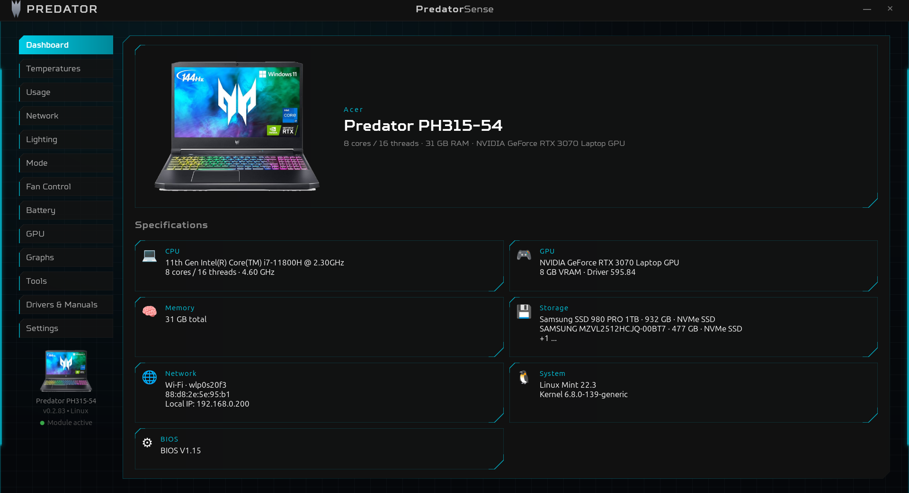</p>

<p align="center"><b>Temperaturas</b> — Gauges em tempo real para CPU, GPU, sistema, SSDs NVMe, WiFi e RAM em uma única tela.</p>
<p align="center">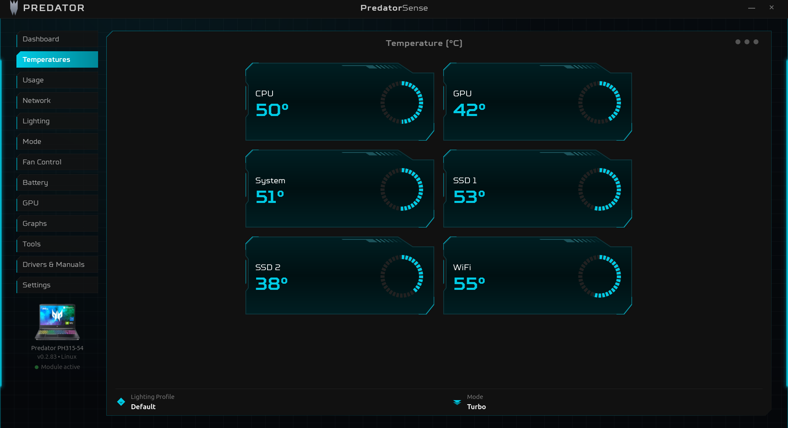</p>

<p align="center"><b>Consumo</b> — CPU, GPU, memória e armazenamento com top processos, barras animadas e detalhes ao clicar (com animação de fogo CSS no gauge de temperatura).</p>
<p align="center">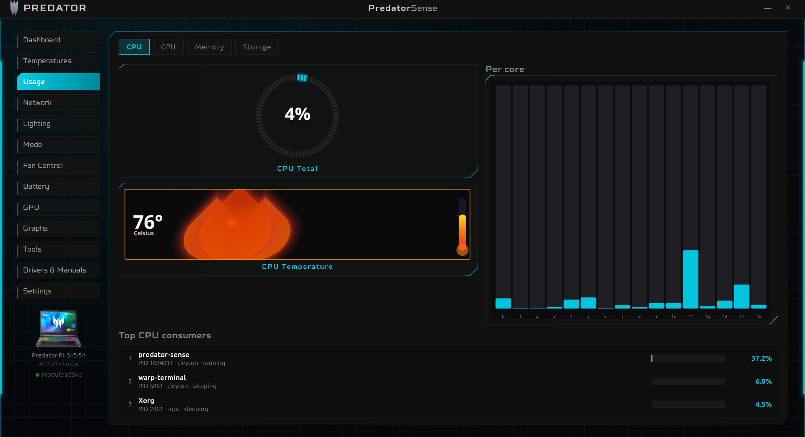</p>

<p align="center"><b>Rede</b> — Gráficos de download/upload em tempo real com tracking de picos e detecção automática de interface (Wi-Fi ou Ethernet).</p>
<p align="center">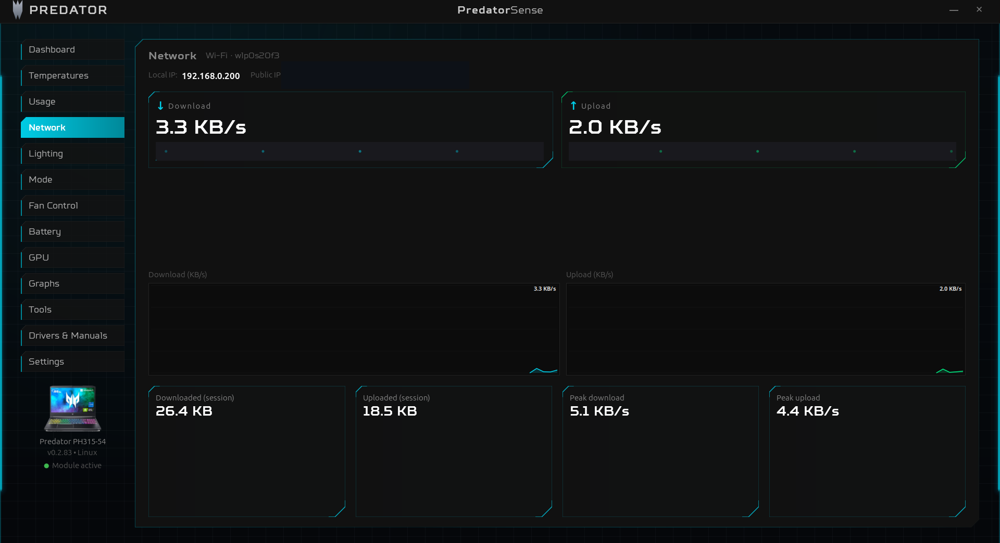</p>

<p align="center"><b>Iluminação</b> — Cores estáticas por zona (4 secções) e efeitos dinâmicos RGB do teclado (Respiração, Neon, Onda, Deslizar, Zoom).</p>
<p align="center">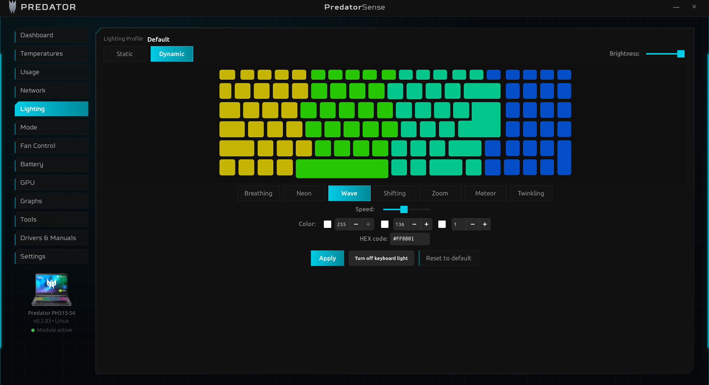</p>

<p align="center"><b>Modos</b> — Perfis de desempenho: Silencioso, Balanceado, Performance e Turbo (CPU governor + Intel EPP + limite de potência da GPU).</p>
<p align="center">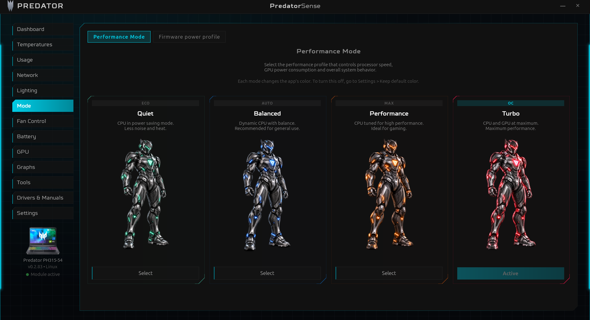</p>

<p align="center"><b>GameSync</b> — Cadastre um jogo e o perfil desejado; o app troca automaticamente enquanto o jogo está rodando e restaura o que estava ativo antes assim que ele fecha.</p>
<p align="center">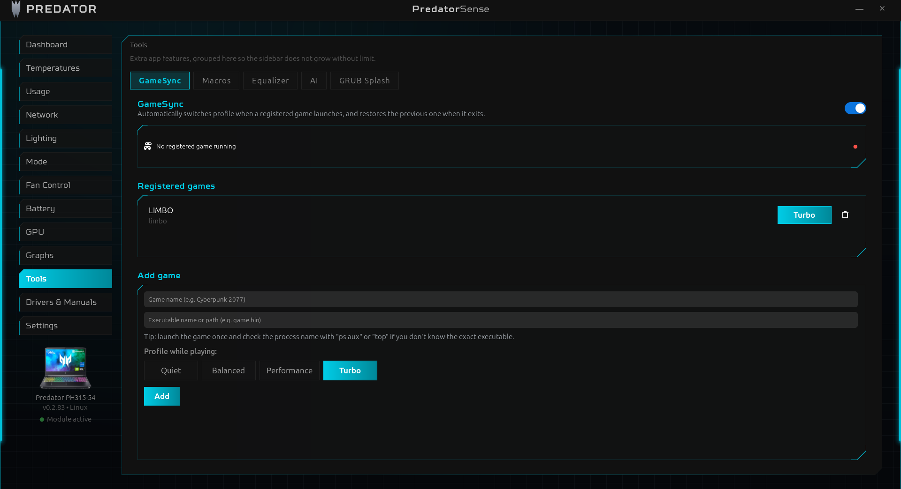</p>

<p align="center"><b>Controle de Ventoinha</b> — RPM ao vivo com animação girando, toggle do CoolBoost e modos Auto/Max.</p>
<p align="center">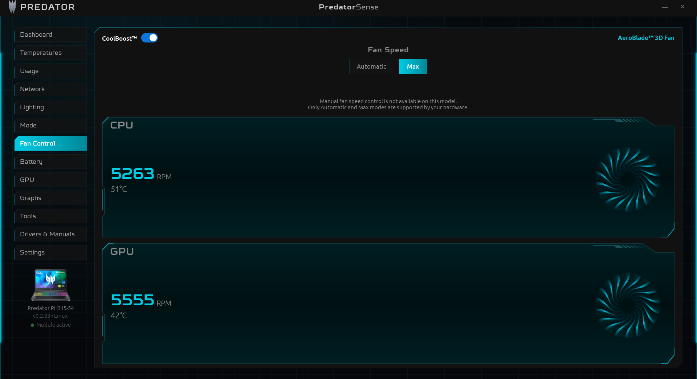</p>

<p align="center"><b>Bateria</b> — Percentual de carga, voltagem, corrente, potência, ciclos, saúde, fabricante e limite de carga em 80% para preservar a longevidade.</p>
<p align="center">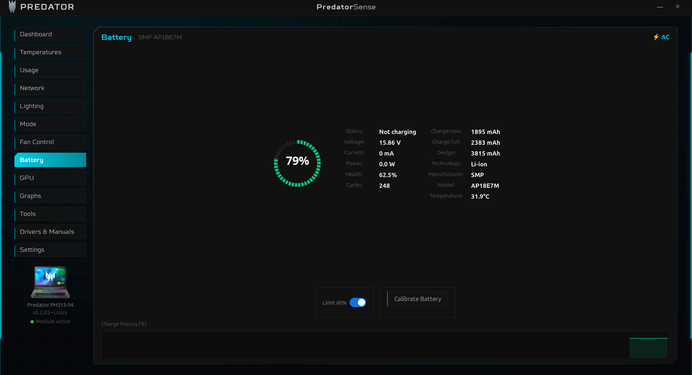</p>

<p align="center"><b>GPU</b> — Dashboard NVIDIA com gráficos ao vivo, clocks, utilização, VRAM, consumo e informações PCIe.</p>
<p align="center">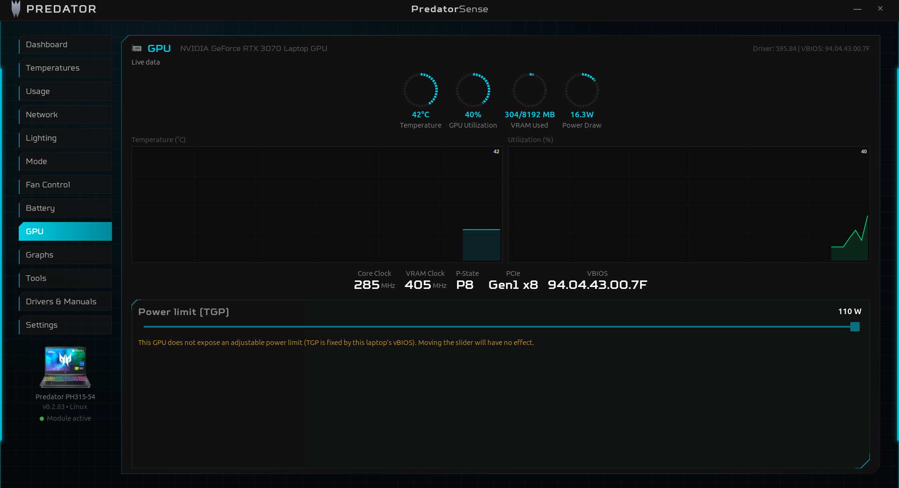</p>

<p align="center"><b>Gráficos</b> — Histórico detalhado de CPU e GPU com tracking de mínimas e máximas.</p>
<p align="center">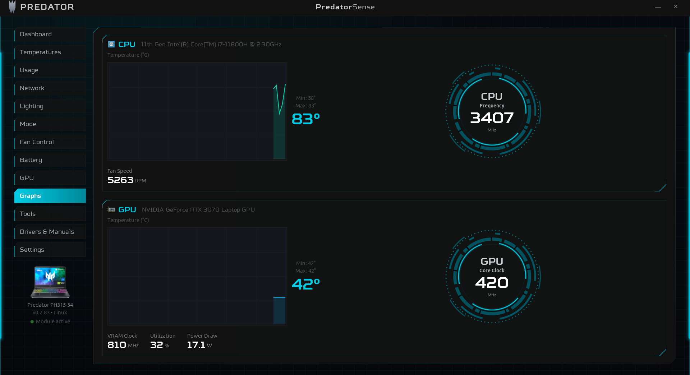</p>

<p align="center"><b>Assistente de IA (beta)</b> — Assistente de IA local via Ollama: chat, gerenciador de modelos (listar instalados, baixar novos, escolher qual roda), consumo de recurso/VRAM ao vivo enquanto ele pensa, e log de ações persistente.</p>
<p align="center">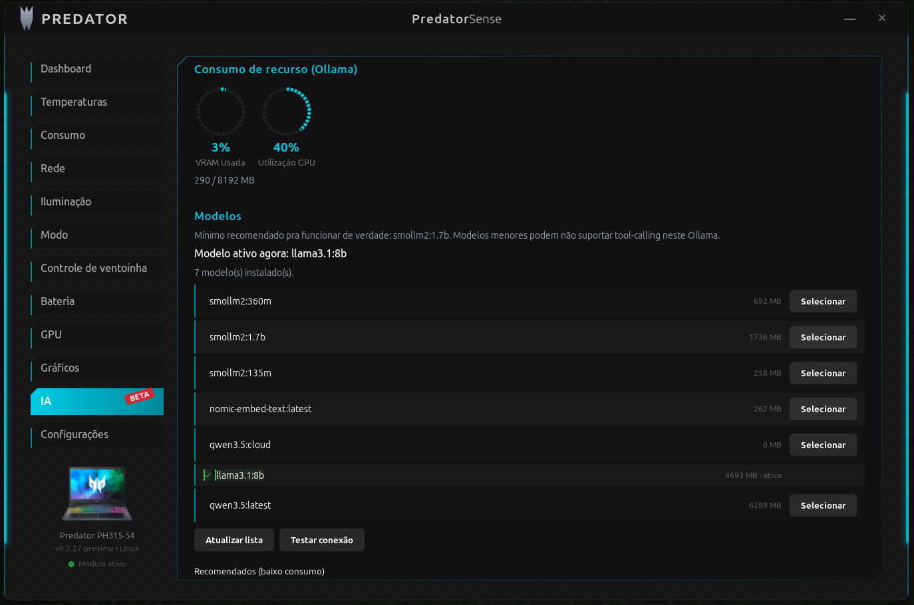</p>

<p align="center"><b>Drivers e manuais</b> — Mostra o número de série (com botão de copiar) e um link direto pra página oficial de drivers e manuais da Acer, além de uma ilustração de onde achar a etiqueta do número de série no notebook.</p>
<p align="center">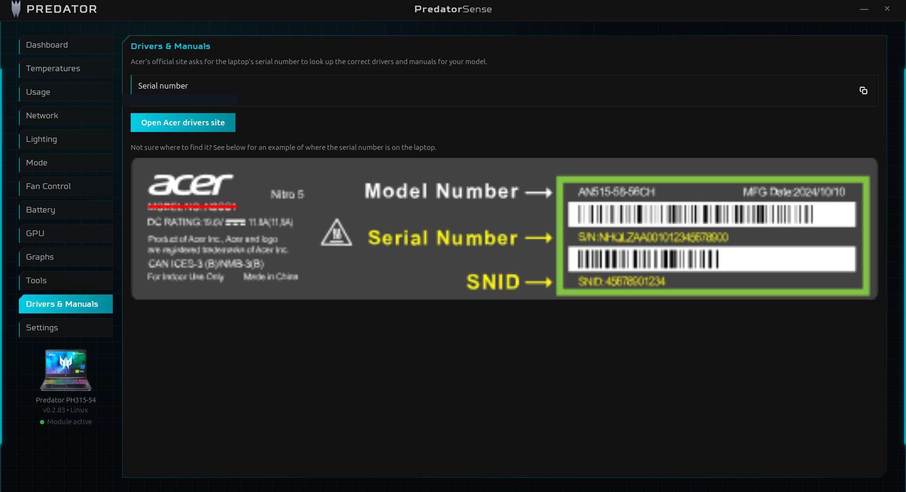</p>

<p align="center"><b>Configurações</b> — Minimizar para a bandeja, iniciar com o sistema, aplicar perfil automaticamente no início, preferências de idioma, e lista de recursos suportados por modelo.</p>
<p align="center">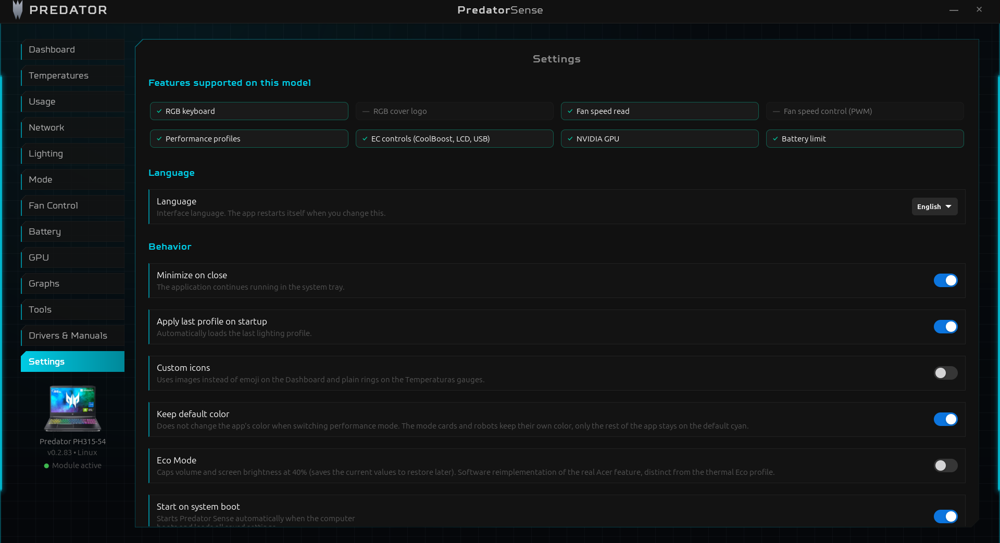</p>

<p align="center"><b>Iluminação do logo da tampa</b> — Controle RGB independente pro logo na parte de trás da tela, em modelos com logo colorido (Estático/Respiração/Neon). Detectado em tempo real: o controle só aparece se o hardware responder a um probe de capacidade, ficando escondido com segurança em modelos sem esse recurso.</p>
<p align="center">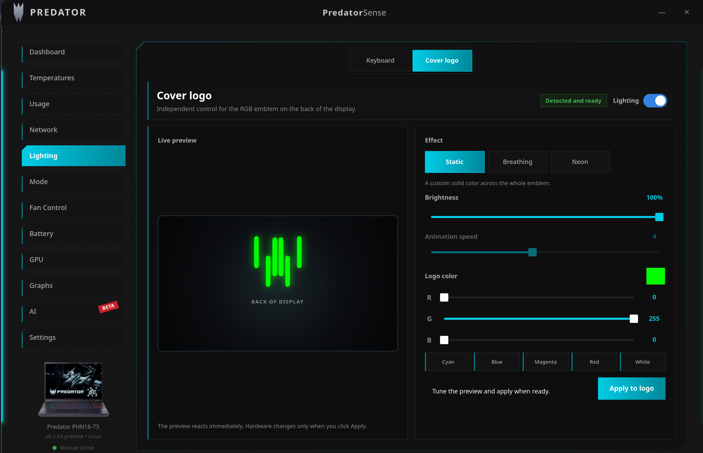</p>
<p align="center">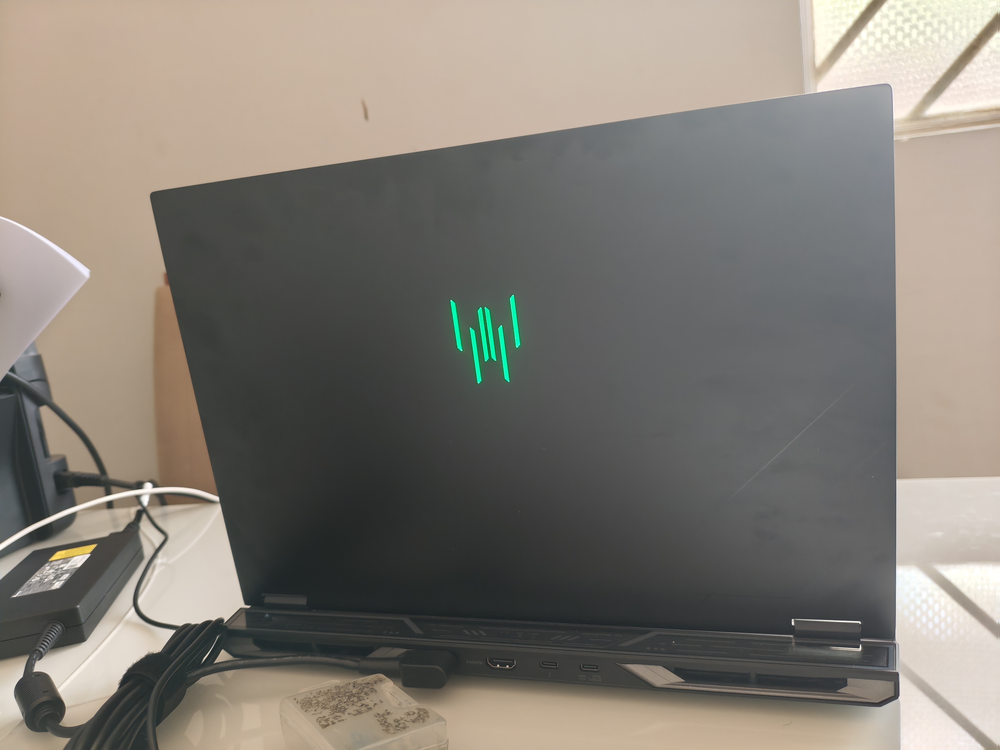</p>
<p align="center"><sub>Recurso contribuído por <a href="https://github.com/jlucaso1">@jlucaso1</a>, testado no próprio Predator PHN16-73 dele. O logo da tampa deste notebook do autor deste projeto não tem cor, então o recurso foi validado usando o hardware dele.</sub></p>

---

## Sobre

Módulo não oficial do kernel Linux para retroiluminação RGB de teclados Acer Gaming e modo Turbo (Acer Predator, Acer Helios, Acer Nitro).

Inspirado e baseado no projeto [acer-predator-turbo-and-rgb-keyboard-linux-module](https://github.com/JafarAkhondali/acer-predator-turbo-and-rgb-keyboard-linux-module) de [JafarAkhondali](https://github.com/JafarAkhondali) e contribuidores. Este projeto estende o módulo atual do kernel Linux Acer-WMI para oferecer suporte às funções de jogos da Acer, e adiciona uma **aplicação desktop completa** desenvolvida em Rust e GTK4.

---

## Funcionalidades

| Funcionalidade | Descrição |
|----------------|-----------|
| **Dashboard** | Foto do notebook + specs completas do sistema (CPU, GPU, RAM, armazenamento, rede, SO) |
| **Temperaturas** | Gauges em tempo real para CPU, GPU, sistema, NVMe, WiFi e RAM |
| **Consumo** | Visão em 4 abas: CPU / GPU / Memória / Armazenamento, com top processos, detalhes ao clicar e animação de fogo CSS no gauge de temperatura |
| **Rede** | Gráficos de download/upload em tempo real, com tracking de pico e detecção automática de interface |
| **Controle RGB do Teclado** | Cores estáticas por zona (4 zonas) e efeitos dinâmicos (Respiração, Neon, Onda, Deslizar, Zoom) via WMI. Em hardware sem o módulo kernel, RGB funciona nativamente via USB/I2C-HID — chip ENEK5130 (4 zonas estáticas, Respiração/Neon), chip Sunrex 2024+ (zona única, lista completa de efeitos) ou chip Chicony (paleta de 7 cores, Helios 300) — auto-detectado, veja [Compatibilidade](#compatibilidade) |
| **Logo RGB da Tampa** | Controle independente de energia, cor estática, brilho, Respiração e Neon para o emblema atrás da tela, com prévia vetorial ao vivo. Só aparece após detecção de capacidades HID em tempo de execução |
| **Perfis de Desempenho** | Silencioso / Balanceado / Performance / Turbo (CPU governor + Intel EPP + limite de potência da GPU) |
| **Controle de Ventoinha** | RPM ao vivo com animação girando, toggle do CoolBoost, modos Auto/Max, e controle PWM por ventoinha + curva automática por temperatura (experimental, onde suportado) |
| **Bateria** | Estatísticas de carga, ciclos, saúde, fabricante e limite de carga em 80% para preservar a longevidade |
| **Dashboard GPU** | Métricas NVIDIA: temperatura, utilização, VRAM, clocks, consumo, info PCIe com gráficos ao vivo, e **slider de limite de potência (TGP)** |
| **Gráficos** | Histórico detalhado de CPU e GPU com tracking de mínimas e máximas |
| **Assistente de IA** 🧪 | Assistente de IA local e opt-in via [Ollama](https://ollama.com) — lê o estado do hardware em tempo real e sugere ou aplica mudanças através de um conjunto fixo de ações já validadas (perfil térmico, modo de ventoinha, CoolBoost, RGB, limite de potência da GPU, bateria). Chat, gerenciador de modelos (baixar/selecionar), monitor de recurso/VRAM ao vivo e log de ações persistente. Aplicar automaticamente ou sempre confirmar, você escolhe. Requer o Ollama instalado separadamente — veja [Assistente de IA](#assistente-de-ia-beta) abaixo |
| **Detecção automática de recursos** | Detecta o que cada modelo suporta e adapta a interface — recursos sem suporte aparecem como "não disponível neste modelo" em vez de erro. Os recursos suportados são listados nas Configurações |
| **Alertas de temperatura** | Notificação no desktop quando CPU/GPU passam de 90°C (funciona na bandeja) |
| **Perfil automático por energia** | Troca de perfil automaticamente ao conectar/desconectar o carregador — perfil de cada estado é configurável em Configurações (padrão: Performance na tomada, Balanceado na bateria) |
| **Log de depuração** | Toggle opcional em Configurações — grava eventos do daemon e do app em `~/.local/share/predator-sense/` (rotacionado, 5MB×3) pra diagnóstico remoto. Desligado por padrão |
| **Bandeja do Sistema** | Minimizar para a bandeja com o ícone Predator — app continua vivo em segundo plano |
| **Tecla PredatorSense** | Mapeamento da tecla física — a tecla ao lado do NumLock abre a aplicação |
| **DKMS** | Módulos do kernel recompilam automaticamente em atualizações do kernel |
| **Internacionalização** | Inglês / Português automático baseado no idioma do sistema |
| **Interface Gaming** | Tema escuro com barras neon pulsantes, gauges circulares tracejados, bordas poligonais |

---

## Compatibilidade

**Vai funcionar no meu notebook?**

Legenda: ✅ testado e funcionando · 🟡 implementado, não testado (precisa de testador) · 🧪 experimental (precisa de testador) · ❌ não funciona · `-` não se aplica

| Modelo | Turbo (Impl.) | Turbo (Test.) | RGB (Impl.) | RGB (Test.) | Leitura RPM | Perfis de fan | Fan PWM % |
|--------|:---:|:---:|:---:|:---:|:---:|:---:|:---:|
| AN515-45 | - | - | ✅ | ✅ | ❌ | - | ❌ |
| AN515-55 | - | - | ✅ | ✅ | ❌ | - | ❌ |
| AN515-56 | - | - | ✅ | ✅ | ❌ | - | ❌ |
| AN515-57 | - | - | ✅ | ✅ | ❌ | - | ❌ |
| AN515-58 | ✅ | 🟡 | ✅ | ✅ | 🟡 | 🟡 | 🧪 |
| AN517-41 | - | - | ✅ | ✅ | ❌ | - | ❌ |
| PH16-71 | ✅ | 🟡 | ✅ | 🟡 | 🟡 | - | ❌ |
| PH16-72 | ✅ | 🟡 | ✅ | 🟡 | 🟡 | 🟡 | 🧪 |
| PH315-52 | ✅ | ✅ | ✅ | ✅ | 🟡 | - | ❌ |
| PH315-53 | ✅ | ✅ | ✅ | ✅ | 🟡 | - | ❌ |
| **PH315-54** | ✅ | ✅ | ✅ | ✅ | ✅ | ✅ | ❌ |
| PH315-55 | ✅ | 🟡 | ✅ | ❌ | 🟡 | - | ❌ |
| PH317-53 | ✅ | ✅ | ✅ | ✅ | 🟡 | - | ❌ |
| PH317-54 | ✅ | 🟡 | ✅ | 🟡 | 🟡 | - | ❌ |
| PH317-55 | - | - | ✅ | 🟡 | ❌ | - | ❌ |
| PH317-56 | ✅ | 🟡 | ✅ | 🟡 | 🟡 | - | ❌ |
| PH517-51 | ✅ | 🟡 | ✅ | 🟡 | 🟡 | - | ❌ |
| PH517-52 | ✅ | 🟡 | ✅ | 🟡 | 🟡 | - | ❌ |
| PH517-61 | ✅ | 🟡 | ✅ | ✅ | 🟡 | - | ❌ |
| PHN16-71 | ✅ | 🟡 | ✅ | 🟡 | 🟡 | - | ❌ |
| PHN16S-71 | ✅ | ✅ | ✅ | ✅ | ✅ | - | ❌ |
| PHN16-72 | ✅ | ✅ | ✅ | ✅ | ✅ | ✅ | 🧪 |
| **PHN16-73** | ✅ | ✅ | ✅ | ✅ | ✅ | ✅ | ✅ |
| PHN18-71 | ✅ | ✅ | ✅ | ✅ | 🟡 | - | ❌ |
| PT314-51 | ❌ | ❌ | ✅ | ✅ | 🟡 | - | ❌ |
| PT314-52s | ✅ | ✅ | ✅ | 🟡 | 🟡 | - | ❌ |
| PT315-51 | ✅ | ✅ | ✅ | ✅ | 🟡 | - | ❌ |
| PT316-51 | ✅ | ✅ | ✅ | ✅ | 🟡 | - | ❌ |
| PT515-51 | ✅ | ✅ | ✅ | ✅ | 🟡 | - | ❌ |
| PT516-52s | ✅ | 🟡 | ✅ | ✅ | 🟡 | - | ❌ |
| PT917-71 | ✅ | 🟡 | ✅ | 🟡 | 🟡 | - | ❌ |

> Se o seu modelo não está listado, ele ainda pode funcionar — o módulo do kernel detecta interfaces WMI compatíveis automaticamente. Se funcionou (ou não) para você, por favor abra uma issue mencionando seu modelo para que possamos atualizar esta tabela.

### Controle de ventoinha — três níveis

| Nível | O que faz | Disponibilidade |
|---|---|---|
| **Leitura de RPM** | Lê velocidade das ventoinhas CPU/GPU (`fan1_input`, `fan2_input`) | Maioria dos modelos gaming (auto-detectado) |
| **Perfis de ventoinha** | Quiet / Balanced / Performance / Turbo via `platform_profile` | Modelos `predator_v4` |
| **Fan PWM %** 🧪 | Controle de velocidade por ventoinha (`pwm1`/`pwm2` 0–100%) portado do `acer-wmi` mainline via WMI — **somente kernel ≥ 6.14** | Subconjunto de modelos com `ACER_CAP_PWM` (AN515-58, PHN16-72/73, PH16-72, …) |

> **🧪 O controle PWM é experimental.** É portado do driver `acer-wmi` oficial do kernel Linux e usa métodos WMI seguros (sem escrita bruta no EC), mas **não foi verificado em hardware real** pelo mantenedor (que tem um PH315-54, sem PWM). Se você tem um modelo suportado, relatos de teste são muito bem-vindos. **Use por sua conta e risco** — veja o aviso no topo.

### RGB sem o módulo kernel (só hardware I2C-HID)

Alguns modelos (confirmado: PHN16S-71, PHN16-73) roteiam o controlador RGB do teclado por um chip I2C-HID separado (ENEK5130) em vez da interface WMI do `facer.ko` — o app fala direto com ele via `/dev/hidrawN`, então funciona mesmo sem o módulo kernel carregado:

| Recurso | Status |
|---|---|
| Cor estática por zona, brilho, desligar luz | ✅ confirmado funcionando (PHN16S-71) |
| Efeitos dinâmicos — Respiração, Neon | ✅ confirmado funcionando (PHN16S-71) — nativo, um único write HID, hardware faz o loop do padrão sozinho. Nesta unidade, Respiração ignora a cor escolhida e cicla o arco-íris sozinho; pode variar em outro hardware |
| Efeitos dinâmicos — Onda, Deslizar, Zoom | Só prévia visual na tela (sem escrita em hardware) — os códigos desses efeitos variam de significado entre gerações de hardware, então ainda não foram ativados |
| Logo RGB da tampa — desligar, cor estática, brilho, Respiração, Neon | ✅ confirmado funcionando (PHN16-73) |

O suporte ao logo da tampa não é ativado por uma allow-list de modelos. O controlador precisa anunciar o alvo `0x83` no relatório A1 e retornar capacidades A3 correspondentes e não vazias antes que a interface apareça; o app repete essa verificação imediatamente antes de cada escrita. O daemon de hotkey restaura somente uma configuração que o app aplicou com sucesso após login e retorno do modo de suspensão, e ignora totalmente o logo quando não há configuração salva ou o alvo está ausente.

### RGB em hardware 2024+ (USB HID Sunrex/Darfon)

Uma geração mais nova (PH16-72 e outros modelos 2024-2026 que compartilham os mesmos chips USB HID, veja a issue #26) tirou o RGB do teclado e do logo tanto da WMI quanto do chip ENEK5130 acima, colocando num par de controladores diferente — Sunrex `05af:*` pro teclado, Darfon `0d62:*` pro logo. O app detecta e fala com eles direto também, escolhido automaticamente sobre os caminhos ENEK5130/WMI quando presente:

| Recurso | Status |
|---|---|
| Teclado: Desligado, Estático, Respiração, Onda, Cobra, Neon, Ponto, Estrela, Arco-íris, 5× Corte, Zoom, Onda de linha, Deslizamento | 🟡 implementado, aguardando confirmação em hardware real |
| Logo da tampa: desligar, cor sólida, brilho, Respiração | 🟡 implementado, aguardando confirmação em hardware real |

Esse chip não tem zonas independentes — o teclado inteiro usa uma cor/efeito por vez, diferente do controlador ENEK5130 de 4 zonas acima. O protocolo foi reverso-engenheirado byte a byte a partir de duas versões decompiladas do app oficial Windows (toda sequência de bytes fixa e fórmula de checksum bateu exatamente entre as duas), não é chute — mas ninguém confirmou ainda em hardware físico, então trate como não testado até chegar um relato real.

Um terceiro chip (Chicony, Helios 300/PH317-56) usa outro protocolo USB HID, documentado por engenharia reversa da comunidade ([NT411/Acer-Predator-Fan-RGB-Controller-Linux](https://github.com/NT411/Acer-Predator-Fan-RGB-Controller-Linux)) e reimplementado aqui a partir dessa especificação — paleta fixa de 7 cores (limitação de hardware/firmware, não é RGB arbitrário) em 12 efeitos. Também 🟡, aguardando confirmação.

### Já usa Linuwu-Sense ou DAMX?

[Linuwu-Sense](https://github.com/0x7375646F/Linuwu-Sense) (e o [DAMX](https://github.com/PXDiv/Div-Acer-Manager-Max), construído sobre ele) é um projeto separado e não relacionado, que também controla hardware Acer Predator/Nitro no Linux. Não é dependência deste projeto, nenhum código dele é usado aqui — mas o módulo kernel dele reivindica os **mesmos GUIDs WMI** que o `facer` precisa, e o kernel não deixa dois drivers reivindicarem o mesmo dispositivo ao mesmo tempo.

Se o instalador detectar `linuwu_sense` já carregado ou registrado via DKMS, ele automaticamente **não mexe** na sua instalação existente — não coloca `acer_wmi` na blacklist nem força carregar `facer`, então não briga (nem quebra) uma instalação Linuwu-Sense/DAMX que já funciona. O RGB do teclado continua funcionando por este app via HID (ver acima) independente de qual driver de plataforma está ativo; controle de ventoinha/térmico nesse caso continua com a ferramenta que você já usava.

---

## Instalação

### Instalador Pré-compilado (Mais Rápido)

Baixe diretamente o instalador da release e execute:

```console
curl --fail --location https://github.com/cleyton1986/predator-sense/releases/latest/download/predator-sense-installer --output predator-sense-installer
chmod +x predator-sense-installer
sudo ./predator-sense-installer --install
```

O instalador, o helper privilegiado, o listener da tecla e o serviço da bandeja são fornecidos pelo mesmo binário multicall em Rust. O instalador baixa e configura tudo sem depender de um script de shell para o bootstrap.

### Instalador Interativo (binário pré-compilado, sem precisar de Rust)

Baixe o binário `predator-sense-installer` da página de [Releases](../../releases). É um binário Rust independente, não um pacote fechado — ainda precisa de internet pra baixar o código fonte do app (por causa do módulo kernel) e o binário pré-compilado da release correspondente, mas não instala Rust nem compila o app GTK4 na sua máquina:

```console
chmod +x predator-sense-installer
sudo ./predator-sense-installer
```

Selecione a **opção 1** (Instalação completa). O instalador irá automaticamente:

1. Detectar sua distribuição (Debian/Ubuntu/Mint, Fedora, Arch)
2. Instalar dependências do sistema (GTK4, libadwaita, ferramentas de compilação, headers do kernel)
3. Baixar o código fonte + binário pré-compilado da release correspondente
4. Compilar e carregar o módulo do kernel `facer` (essa parte sempre compila localmente — módulo de kernel não dá pra distribuir pré-compilado entre versões de kernel diferentes)
5. Criar atalho no menu de aplicações com ícone
6. Mapear a tecla PredatorSense (inicia automaticamente no login)
7. Configurar suporte à bandeja do sistema

O caminho pré-compilado não precisa de Rust/cargo na máquina de destino. O instalador também é copiado para `/opt/predator-sense/` como ferramenta de gerenciamento para consultar status, recarregar o módulo do kernel, atualizar e desinstalar (ver [Opções do Instalador](#opções-do-instalador)).

Após a instalação, abra a aplicação por:
- Pressionando a **tecla PredatorSense** (ao lado do NumLock)
- Buscando **"Predator Sense"** no menu de aplicações
- Executando `/opt/predator-sense/predator-sense` no terminal

### Instalação Manual (Compilar do código fonte)

#### Pré-requisitos

<details>
<summary><b>Debian / Ubuntu / Linux Mint</b></summary>

```console
sudo apt install libgtk-4-dev libadwaita-1-dev pkg-config build-essential \
    gcc make dkms curl tar linux-headers-$(uname -r)
```
</details>

<details>
<summary><b>Fedora</b></summary>

```console
sudo dnf install gtk4-devel libadwaita-devel pkg-config gcc make \
    dkms curl tar kernel-devel-$(uname -r)
```
</details>

<details>
<summary><b>Arch Linux</b></summary>

```console
sudo pacman -S gtk4 libadwaita pkgconf gcc make dkms curl tar linux-headers
```
</details>

**Rust** (se não instalado):
```console
curl --proto '=https' --tlsv1.2 -sSf https://sh.rustup.rs | sh
source ~/.cargo/env
```

#### Compilar e Instalar

```console
# Clonar o repositório
git clone https://github.com/cleyton1986/predator-sense.git
cd predator-sense/predator-sense-gui

# Compilar a GUI e o instalador/serviços Rust
cargo build --release
cargo build --release --manifest-path installer/Cargo.toml

# Instalar o build local e registrar os fontes C existentes no DKMS
sudo installer/target/release/predator-sense-installer --install

# Executar
/opt/predator-sense/predator-sense
```

---

## Como Usar

### RGB do Teclado

1. Vá em **Iluminação** no menu lateral
2. Escolha **Estático** (cores por zona) ou **Dinâmico** (efeitos)
3. **Modo Estático:** ajuste os sliders R/G/B para cada uma das 4 secções do teclado
4. **Modo Dinâmico:** selecione um efeito (Respiração, Neon, Onda, Deslizar, Zoom) e ajuste a velocidade
5. Clique em **Aplicar**

> Em hardware só I2C-HID sem o módulo kernel (veja [Compatibilidade](#compatibilidade)), Respiração e Neon animam de verdade; Onda/Deslizar/Zoom mostram só prévia visual, claramente rotulada como tal — o teclado físico ainda não muda pra esses.

### Logo RGB da Tampa

1. Vá em **Iluminação** e selecione **Logo da tampa** (o seletor só aparece quando o alvo HID compatível é detectado)
2. Use **Iluminação** para ligar ou desligar o emblema
3. Escolha **Estático**, **Respiração** ou **Neon** e ajuste os controles disponíveis de cor, brilho e velocidade acompanhando a prévia ao vivo
4. Clique em **Aplicar no logo**

O último estado aplicado com sucesso é restaurado quando o serviço de hotkey do usuário inicia e após suspensão/hibernação. As cores dos efeitos animados são controladas pelo firmware; por isso a prévia representa o comportamento deles e o seletor de cor fica reservado ao modo estático.

> O firmware controla a animação exibida antes de o Linux iniciar o serviço do usuário. Um estado “desligado” salvo é restaurado após o login, mas o app não consegue suprimir a animação anterior do BIOS/boot.

### Perfis de Desempenho

Em sistemas com Intel P-State ativo + HWP, a parte de CPU é resolvida assim:

| Perfil | Política HWP | Intel EPP | Performance mínima | GPU Power | Ventoinha | Uso |
|--------|--------------|-----------|--------------------|-----------|-----------|-----|
| **Silencioso** | powersave | power | 10% | 40W³ | Automático | Trabalho silencioso |
| **Balanceado** | powersave | balance_performance | 17% | 80W³ | Automático | Uso geral |
| **Performance** | powersave¹ | performance | 50% | 100W³ | Máx | Jogos |
| **Turbo** | performance² | 0 (forçado pelo kernel) | 100% | 110W³ | Máx | Performance máxima |

Selecionar qualquer perfil já aplica o modo de ventoinha junto - sem passo
separado. Performance e Turbo colocam a ventoinha em Máx (igual à tecla física
Turbo); Silencioso e Balanceado deixam em Automático.

¹ A política HWP `powersave` do Intel P-State é um algoritmo de escalonamento
dinâmico, não o governor genérico que fixa a frequência mínima. Ela mantém o
EPP nominal específico do modelo gravável e torna Performance uma faixa
dinâmica de 50% até o máximo.

² A própria política HWP `performance` força EPP 0 e restringe a faixa de
P-states ao limite superior. O Predator Sense usa esse comportamento garantido
pelo kernel em vez de exigir escrita numérica de EPP. O backend é detectado em
todas as políticas cpufreq, sem uma lista de modelos de CPU. Outros drivers
mantêm o mapeamento existente `performance` + EPP nominal `performance`, e
sistemas sem EPP ignoram apenas esse controle opcional.

³ Melhor esforço via `nvidia-smi -pl`, mesmo mecanismo do slider de limite de
potência do Dashboard GPU - pulado silenciosamente se `nvidia-smi` não existir,
e em alguns notebooks a vBIOS nunca expõe o controle de limite de potência que
o NVML precisa (`nvidia-smi -q` mostra `Power Management Object: N/A`, todo
valor de `-pl` é rejeitado independente do que for pedido). É limite de
firmware, não algo que este app - ou qualquer software Linux - consiga mudar;
aumentar isso exige flashear uma vBIOS diferente com ferramenta Windows-only
como `nvflash`, risco real de brickar a GPU, decisão exclusivamente do dono do
hardware.

### Perfil automático por energia

Quando ativado em Configurações (ligado por padrão em instalações novas), não
é só reação a plugar/desplugar - é aplicado continuamente:
- **Na tomada:** sempre Performance ou Turbo. Se um dos dois já estiver ativo,
  fica como está - o auto-switch nunca briga com uma escolha manual entre os
  dois.
- **Na bateria:** sempre Balanceado ou Silencioso, nunca Performance/Turbo.
  Abaixo de 15% de bateria, força Silencioso independente do que estiver
  configurado.

### Dashboard GPU

Monitoramento NVIDIA em tempo real:
- Temperatura, utilização, uso de VRAM, consumo (gauges circulares)
- Gráficos de histórico de temperatura e utilização (janela de 2 minutos)
- Clock do núcleo, clock da memória, P-State, link PCIe, versão do VBIOS

### Assistente de IA (beta)

Um assistente de IA local e opt-in, via [Ollama](https://ollama.com) rodando inteiramente na sua máquina — nada é enviado pra lugar nenhum.

1. Instale o Ollama separadamente seguindo as [instruções oficiais para Linux](https://ollama.com/download/linux)
2. Vá em **IA** no menu lateral e baixe um modelo pelo gerenciador de modelos integrado (`smollm2:1.7b` ou maior — modelos menores não suportam tool-calling de forma confiável)
3. Ative o assistente em **Configurações** e escolha **Aplicar automaticamente** (aplica sugestões na hora) ou **Sempre confirmar** (padrão — toda mudança sugerida espera sua aprovação)

O assistente lê o estado do hardware em tempo real (temperatura, ventoinha, perfil térmico, bateria) e pode sugerir ou aplicar mudanças através de um conjunto fixo de ações já validadas — nunca acessa hardware/EC diretamente, e cada ação corresponde 1:1 a uma função que esta aplicação já usava antes mesmo da IA existir. O modelo carrega só pra rodar uma análise e depois descarrega — não fica parado consumindo memória. Toda atividade da IA fica registrada num log de ações persistente e revisável, na mesma página.

---

## Opções do Instalador

O instalador Rust oferece um menu interativo:

```console
sudo ./predator-sense-installer              # Menu interativo
sudo ./predator-sense-installer --install    # Instalação direta
sudo ./predator-sense-installer --uninstall  # Remover tudo
sudo ./predator-sense-installer --reload-module # Recompilar/recarregar o módulo
sudo ./predator-sense-installer --status     # Ver status dos componentes
```

---

## Desinstalar

```console
sudo ./predator-sense-installer  # Selecione a opção 2
```

Ou manualmente:
```console
pkill -f "/opt/predator-sense/predator-sense"
sudo rm -rf /opt/predator-sense
sudo rm -f /usr/share/applications/predator-sense.desktop
sudo rm -f /usr/share/icons/hicolor/128x128/apps/predator-sense.png
rm -f ~/.config/systemd/user/predator-sense-hotkey.service
rm -f ~/.config/autostart/predator-sense-hotkey.desktop
sudo rmmod facer  # Opcional: descarregar o módulo do kernel
```

---

## Solução de Problemas

<details>
<summary><b>RGB do teclado não muda / preso em um efeito</b></summary>

O estado do módulo do kernel pode estar travado. Recarregue-o:
```console
sudo rmmod facer
sudo insmod /caminho/para/kernel/facer.ko
# Ou use o instalador: sudo ./predator-sense-installer → Opção 4
```
</details>

<details>
<summary><b>Módulo não carrega</b></summary>

```console
# Verifique se o dispositivo WMI existe
ls /sys/bus/wmi/devices/7A4DDFE7-5B5D-40B4-8595-4408E0CC7F56/

# Verifique os logs do kernel
sudo dmesg | grep -i facer

# Certifique-se que os headers correspondem ao seu kernel
sudo apt install linux-headers-$(uname -r)
```
</details>

<details>
<summary><b>Tecla PredatorSense não funciona</b></summary>

```console
# Verifique o serviço Rust da tecla
systemctl --user status predator-sense-hotkey.service
pgrep -af predator-sense-hotkey

# Certifique-se que o usuário está no grupo 'input' (logout necessário após adicionar)
groups | grep input
sudo usermod -aG input $USER
```
</details>

<details>
<summary><b>Página GPU não mostra dados</b></summary>

```console
# Verifique se o nvidia-smi funciona
nvidia-smi
# Se não, instale os drivers proprietários da NVIDIA
```
</details>

<details>
<summary><b>Meu modelo não tem quirk correspondente (sem perfis/leitura de fan/PWM)</b></summary>

Se seu modelo exato ainda não está na lista de compatibilidade, tente forçar todos os recursos opcionais da família `predator_v4` e veja o que funciona no seu hardware:

```console
sudo modprobe facer enable_all=1
# persistente entre reboots:
echo "options facer enable_all=1" | sudo tee /etc/modprobe.d/facer-options.conf
```

É só WMI (sem escrita raw na EC), então em hardware que não implementa determinado recurso isso é um no-op seguro, não uma escrita ruim. Por favor [abra uma issue](https://github.com/cleyton1986/predator-sense/issues) com seu modelo e o que funcionou/não funcionou — é assim que novos quirks são adicionados.
</details>

---

## Estrutura do Projeto

```
predator-sense-gui/
├── kernel/                      # Módulos do kernel Linux (gerenciados por DKMS)
│   ├── facer.c                  # Interface ACPI/WMI com o hardware Acer
│   ├── acer-wmi-battery.c       # Suporte ao limite de carga da bateria
│   ├── acpi_ec.c                # Acesso raw ao EC via /dev/ec (de MusiKid/acpi_ec)
│   ├── Makefile
│   └── dkms.conf                # Config DKMS para recompilação automática
├── installer/                   # Instalador e serviços multicall em Rust
│   ├── Cargo.toml
│   └── src/
│       ├── main.rs              # Dispatch tipado pelo nome do executável instalado
│       ├── constants.rs         # Caminhos, protocolos e constantes de hardware centrais
│       ├── install.rs           # Instalador + registro DKMS
│       ├── helper.rs            # Operações privilegiadas validadas
│       ├── hotkey.rs            # Listener de eventos de input do Linux
│       ├── tray.rs              # Serviço StatusNotifierItem
│       └── i18n.rs              # Mensagens EN/PT tipadas
├── protocol/                    # Contrato tipado compartilhado entre GUI/helper
│   ├── Cargo.toml
│   └── src/lib.rs               # Ações, caminhos, limites e nomes dos binários
├── src/                         # Aplicação Rust GTK4
│   ├── main.rs
│   ├── app_state.rs             # Flag global de visibilidade da janela (gate dos timers)
│   ├── i18n.rs                  # Internacionalização EN/PT
│   ├── config.rs                # Preferências do usuário (JSON)
│   ├── tray.rs                  # Ciclo de vida do serviço Rust da bandeja
│   ├── hardware/
│   │   ├── helper.rs            # Cliente tipado do helper privilegiado
│   │   ├── rgb.rs               # RGB via /dev/acer-gkbbl-*
│   │   ├── hwmon.rs             # Índice /sys/class/hwmon (cacheado em OnceLock)
│   │   ├── sensors.rs           # Temps, fans, RAM, rede
│   │   ├── gpu.rs               # Parser do nvidia-smi com cache TTL
│   │   ├── procs.rs             # Sampler /proc (CPU por core, memória, lista de processos)
│   │   ├── storage.rs           # Uso de disco via df
│   │   ├── sysinfo.rs           # DMI + CPU + GPU + specs do SO
│   │   ├── fan.rs               # Modo de ventoinha + CoolBoost
│   │   ├── extras.rs            # Limite de bateria, LCD overdrive, USB charging, boot anim
│   │   ├── profile.rs           # CPU governor + EPP + GPU power
│   │   ├── ai_assistant.rs      # Tool-calling do Ollama: allow-list fixa mapeada pras funções hardware:: já existentes
│   │   ├── ai_snapshot.rs       # Snapshot efêmero do estado, alimentado à IA e apagado a cada leitura
│   │   ├── ai_actionlog.rs      # Log persistente e revisável de tudo que a IA sugeriu/aplicou
│   │   └── setup.rs             # Gerenciamento do módulo kernel
│   └── ui/                      # Páginas GTK4 (widgets Cairo customizados)
│       ├── window.rs            # Janela principal, sidebar, barras neon, hide-to-tray
│       ├── dashboard_page.rs    # Hero + specs do sistema
│       ├── temperatures_page.rs # Todos os gauges de temperatura
│       ├── usage_page.rs        # CPU/GPU/Mem/Storage com top processos
│       ├── network_page.rs      # Download/upload com tracking de pico
│       ├── rgb_page.rs          # RGB do teclado com zonas visuais
│       ├── fan_control_page.rs  # Ventoinhas animadas + CoolBoost
│       ├── fan_page.rs          # Perfis de desempenho
│       ├── battery_page.rs      # Stats da bateria + limite de carga
│       ├── gpu_page.rs          # Dashboard NVIDIA GPU
│       ├── monitor_page.rs      # Gráficos detalhados de histórico CPU/GPU
│       ├── ai_page.rs           # Assistente de IA: chat, gerenciador de modelos, monitor de recurso, log de ações
│       ├── setup_page.rs        # Wizard de setup do módulo kernel
│       └── gauge_widget.rs      # Widget de gauge circular tracejado
└── resources/
    ├── style.css                # Tema escuro gaming
    └── predator-icon.svg        # Ícone da bandeja
```

---

## Créditos e Agradecimentos

- **Módulo do kernel `facer`** baseado no projeto [acer-predator-turbo-and-rgb-keyboard-linux-module](https://github.com/JafarAkhondali/acer-predator-turbo-and-rgb-keyboard-linux-module) de [JafarAkhondali](https://github.com/JafarAkhondali) e [todos os contribuidores](https://github.com/JafarAkhondali/acer-predator-turbo-and-rgb-keyboard-linux-module/graphs/contributors)
- **Módulo do kernel `acpi_ec`** de [Sayafdine Said (MusiKid)](https://github.com/MusiKid/acpi_ec) — expõe `/dev/ec` para leitura/escrita bruta no EC. Usado pelo helper para definir modos de ventoinha, CoolBoost, LCD overdrive, USB charging e animação de boot.
- **Aplicação GUI** desenvolvida com [Rust](https://www.rust-lang.org/) + [GTK4](https://gtk.org/) + [libadwaita](https://gnome.pages.gitlab.gnome.org/libadwaita/)
- **Instalador e serviços de background** desenvolvidos com [Rust](https://www.rust-lang.org/); a bandeja usa [ksni](https://crates.io/crates/ksni)
- **Ícones do Dashboard e da aba Temperaturas** (`predator-sense-gui/resources/icons/`) do [Flaticon](https://www.flaticon.com), criados por Hilmy Abiyyu A., magnific e mehwish

### Fazendo fork ou reaproveitando este projeto

Este projeto é licenciado sob GPL-3.0, então você é livre pra fazer fork, modificar e redistribuir sob a mesma licença. Se fizer isso — principalmente se construir um app derivado ou reaproveitar partes significativas da GUI/módulo do kernel — **por favor mantenha um crédito visível ao autor original** (uma menção a [Cleyton Alves](https://github.com/cleyton1986) / este repositório no seu README, tela Sobre, ou seção de créditos já resolve). É um pedido pequeno que faz bastante diferença pra um projeto paralelo independente e não remunerado.

## Apoie o Projeto

Se este projeto foi útil para você e gostaria de apoiar o desenvolvimento, considere me pagar um café:

<p align="center">
  <a href="https://www.paypal.com/cgi-bin/webscr?cmd=_donations&business=cleyton1986%40gmail.com&currency_code=BRL&item_name=Predator+Sense+for+Linux">
    
  </a>
</p>

<p align="center">
  <b>PIX:</b> <code>cleyton1986@gmail.com</code>
</p>

Qualquer contribuição é voluntária e muito apreciada! Ajuda a manter o projeto vivo e motiva novas funcionalidades.

---

## Licença

Este projeto é licenciado sob a **GNU General Public License v3.0** — veja o arquivo [LICENSE](LICENSE) para detalhes.

Este é software livre: você pode redistribuí-lo e/ou modificá-lo sob os termos da GNU GPL conforme publicada pela Free Software Foundation.

**Exceção — imagens dos produtos:** a licença GPLv3 acima cobre apenas o código-fonte deste projeto. As fotos de notebooks Acer Predator/Nitro em `predator-sense-gui/resources/models/` são imagens de produto de terceiros (veja [Aviso Legal](#aviso-legal) acima) e **não** estão cobertas pela concessão da GPLv3; todos os direitos sobre essas imagens permanecem com a Acer Inc. e/ou os fotógrafos originais.

**Este software é fornecido "como está", sem garantia de qualquer tipo.** Os autores não se responsabilizam por quaisquer danos que possam ocorrer pelo uso deste software. Ao instalar e usar este software, você reconhece que o faz por sua conta e risco.
